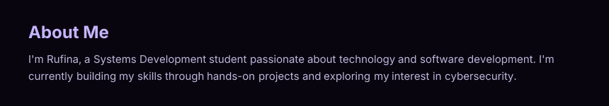
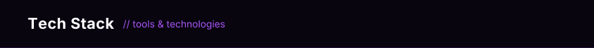

[](https://collectioneur.github.io/readme-aura/)

[](https://collectioneur.github.io/readme-aura/)






````
```aura width=860 height=190
<div style={{
  width: '100%',
  height: '100%',
  background: '#08050F',
  display: 'flex',
  flexDirection: 'column',
  alignItems: 'center',
  justifyContent: 'center',
  padding: '18px 30px',
  boxSizing: 'border-box'
}}>

  <div style={{
    display: 'flex',
    fontSize: 13,
    fontWeight: 700,
    color: '#C4B5FD',
    letterSpacing: '2px',
    marginBottom: 14
  }}>
    TECHNOLOGIES & TOOLS
  </div>

  <div style={{
    display: 'flex',
    alignItems: 'center',
    justifyContent: 'center',
    padding: '12px 22px',
    borderRadius: 16,
    background: 'rgba(168,85,247,0.07)',
    border: '1px solid rgba(168,85,247,0.22)',
    boxShadow: '0 0 30px rgba(168,85,247,0.08)'
  }}>
    
  </div>

  <div style={{
    display: 'flex',
    marginTop: 14,
    gap: 10,
    alignItems: 'center'
  }}>
    <span style={{
      fontSize: 12,
      color: 'rgba(196,181,253,0.65)',
      fontWeight: 500
    }}>
      PuTTY
    </span>

    <span style={{
      fontSize: 12,
      color: 'rgba(168,85,247,0.45)'
    }}>
      •
    </span>

    <span style={{
      fontSize: 12,
      color: 'rgba(196,181,253,0.65)',
      fontWeight: 500
    }}>
      MQTT
    </span>
  </div>

</div>
````


